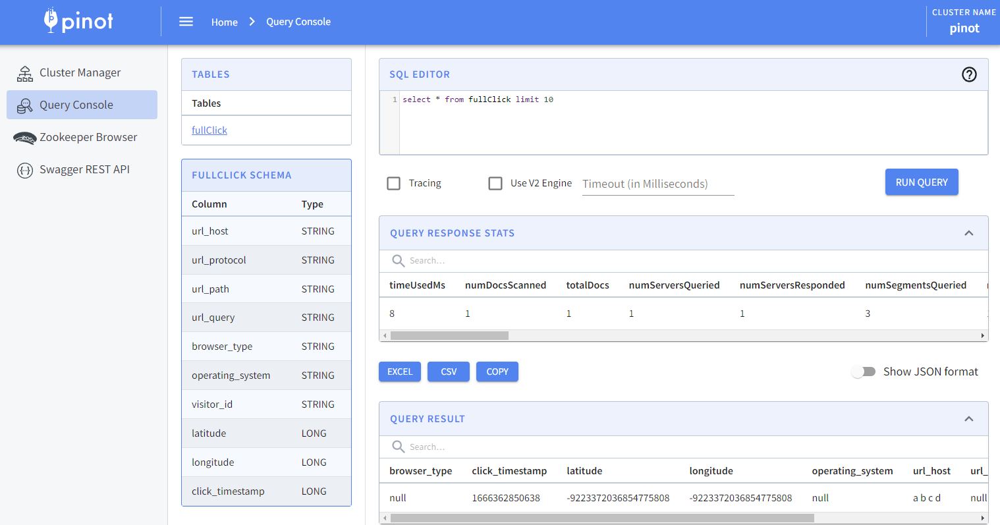

# astra-and-startree-demo
A collection of the things used during the Astra and StarTree demonstration

> This is a WIP at the moment. It doesn't work... yet.

## Prerequisiutes

- [Astra CLI](https://awesome-astra.github.io/docs/pages/astra/astra-cli/)
- cURL
- awk

## Confirm you are logged in to Astra CLI

Follow [this guide](https://awesome-astra.github.io/docs/pages/astra/) to create an Astra account, a token, and config the cli.

```bash
# Should output your astra org uuid
astra org id
```

## Provide the needed auth tokens

Follow [this guide](https://dev.startree.ai/docs/startree-enterprise-edition/startree-cloud/security) to create a Pinot token from your StarTree account.

```bash
PINOT_TOKEN="<TOKEN_HERE>"
```

## Optionally change the cloud, region, or object naming

> Make sure the cloud providers and cloud regions match between DB and Steaming. It is a requirement of Astra CDC.

```bash
ORG_ID=$(astra org id)
CLOUD_PROVIDER_DB="GCP"
CLOUD_REGION_DB="us-central1"
CLOUD_PROVIDER_STREAMING="gcp"
CLOUD_REGION_STREAMING="uscentral1"
DB_NAME="suggestions-demo"
KEYSPACE_NAME="page_view_data"
TABLE_NAME="raw_clicks"
TENANT="webstore-page-views"
```

## Create the database to hold raw click data and retrieve the id

```bash
astra db create \
  --keyspace ${KEYSPACE_NAME} \
  --cloud ${CLOUD_PROVIDER_DB} \
  --region ${CLOUD_REGION_DB} \
  --wait \
  ${DB_NAME}

# Confirm the status is "ACTIVE"
astra db get ${DB_NAME}

# Make sure the database is active before continuing
DB_ID=$(astra db get ${DB_NAME} --key id)
```

## Create the raw clicks table

```bash
astra db cqlsh ${DB_NAME} \
  --execute "CREATE TABLE IF NOT EXISTS ${KEYSPACE_NAME}.${TABLE_NAME}(click_epoch bigint PRIMARY KEY, UTC_offset int, request_url text, user_agent text, visitor_id text, coords text);"
```

## Create the streaming tenant for CDC

```bash
astra streaming create \
  --cloud ${CLOUD_PROVIDER_STREAMING} \
  --region ${CLOUD_REGION_STREAMING} \
  ${TENANT}
  
WEB_SERVICE_URL=$(astra streaming get ${TENANT} -o json | jq -r '.data.cellValues[] | select(.Attribute == "WebServiceUrl") | .Value')
CLUSTER_NAME=$(astra streaming get ${TENANT} -o json | jq -r '.data.cellValues[] | select(.Attribute == "Cluster Name") | .Value')
PULSAR_TOKEN=$(astra streaming pulsar-token ${TENANT})
```

## Enable CDC on the table to create a corresponding topic in the new tenant

```bash
curl -S --fail -X POST ${WEB_SERVICE_URL}/admin/v3/astra/tenants/${TENANT}/cdc \
  --header "Authorization: ${PULSAR_TOKEN}" \
  --header "X-DataStax-Pulsar-Cluster: ${CLUSTER_NAME}" \
  --data '{
  "databaseId": "'${DB_ID}'",
  "databaseName": "'${DB_NAME}'",
  "keyspace": "'${KEYSPACE_NAME}'",
  "orgId": "'${ORG_ID}'",
  "tableName": "'${TABLE_NAME}'",
  "topicPartitions": 3
}'

# Add a row of data to create the topic schema
astra db cqlsh ${DB_NAME} --execute "INSERT INTO ${KEYSPACE_NAME}.${TABLE_NAME}(click_epoch, UTC_offset, request_url, user_agent, visitor_id, coords) values(1665769440000, -4, 'https://request.com/something/', 'a b c d','1234asd','{}');"

# Retrieve the auto-created topic
PULSAR_TOPIC=$(astra streaming pulsar-shell --execute-command "admin topics list ${TENANT}/astracdc" ${TENANT} | grep data-.*-0 | awk '{gsub("-partition-0","");print}')
```

## Create the Pinot table schema

```bash
curl -S --fail -X POST "https://pinot.demo1.chinmayorg.startree.cloud/schemas?override=true" \
  -H "accept: application/json" \
  -H "Authorization: Basic ${PINOT_TOKEN}" \
  -H "Content-Type: application/json" \
  -d "@pinot/full-click-schema.json"
```

## Create a real time Pinot table with Pulsar ingestion

```bash
awk '{gsub("PULSAR_TOKEN","'${PULSAR_TOKEN}'");gsub("PULSAR_TOPIC","'${PULSAR_TOPIC}'");print}' pinot/full-click-table.json > formatted-table.json

curl -S --fail -X POST "https://pinot.demo1.chinmayorg.startree.cloud/tables" \
  -H "accept: application/json" \
  -H "Authorization: Basic ${PINOT_TOKEN}" \
  -H "Content-Type: application/json" \
  -d "@formatted-table.json"
```

## See the new data loaded in Pinot

